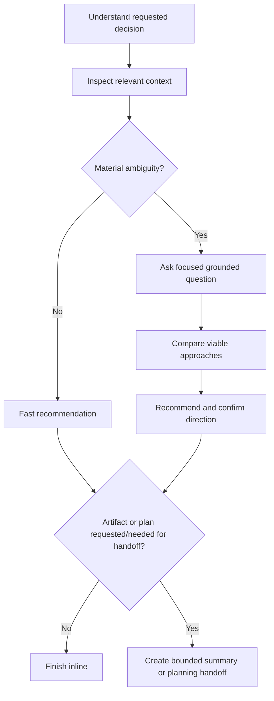

# Brainstorming

Help the user choose the simplest feasible solution by examining material
trade-offs. For a clear one-shot expert answer, use the fast branch rather than
turning the request into a workshop.

## Principles

- Apply YAGNI, KISS, and DRY without treating them as substitutes for evidence.
- Challenge only assumptions that could change the decision.
- Stay within the requested outcome and explicit constraints.
- Distinguish project facts as `verified`, `inferred`, or `unknown`.
- Give a concise reasoning summary; never expose private chain-of-thought.

## `--blindspots`

Inspect only the context needed to understand the topic, then return a short ranked
list of risky assumptions, missing requirements, likely failure modes, and
questions worth answering. Include a one-line mitigation for each. This mode is
advisory: do not require design approval, a report artifact, or plan handoff.

## Route by Material Ambiguity

Material ambiguity means an unanswered question would change architecture, public
contract, cost, security posture, destructive action, scope, or acceptance
criteria. Routine reversible choices are not material ambiguity.

## Fast Branch

Use when the goal and constraints are clear:

1. Read only the files/docs needed for the decision; skip repository-wide scouting.
2. State the recommended approach and decisive evidence.
3. Include alternatives only when they are genuinely viable and materially
   different.
4. State the main risk, assumption, or unknown.
5. Finish inline. Do not force a question, design approval ceremony, report,
   journal, or plan.

## Interactive Branch

Use when material ambiguity remains:

1. Inspect relevant project context so questions are concrete.
2. Ask the smallest focused question that unlocks the decision. Do not loop until
   arbitrary certainty; ask again only if another material choice remains.
3. Compare two or three viable approaches across decision-relevant dimensions such
   as complexity, compatibility, cost, performance, operations, or rollback.
4. Recommend one approach, explain why, and name remaining unknowns.
5. Confirm the direction before any implementation handoff.

If the request contains several independent products or subsystems, recommend a
bounded first decision and list the remaining work as optional follow-ups. Do not
silently expand the brainstorm to design an entire platform.

## Research and Delegation

Use external research only when current or unfamiliar provider/framework behavior
affects the decision. Prefer authoritative sources and delegate only bounded,
independent questions. Use `ck:sequential-thinking` only for genuinely difficult
multi-step analysis, not as a mandatory stage.

## Artifacts, Planning, and Journal

Return the decision inline by default. Create a markdown decision/design summary
only when the user requests it or a multi-session/multi-owner handoff will consume
it. Use the injected naming path if an artifact is required.

Offer or invoke `/ck:plan` only when the user asks for a plan or explicitly chooses
a planning handoff. Pass the bounded decision summary, not an expanded feature
scope. Journal only a durable architectural decision with likely future value.

## Output

Write concise, clear, grammatical output. Include only applicable sections:

- Recommendation
- Material alternatives and trade-offs
- Evidence and assumptions
- Risks or unknowns
- Optional next action

Brainstorming advises and chooses direction; it does not implement code.

## Workflow Position

**May follow:** `/ck:debug` or `/ck:scout` when diagnosis/discovery already exists

**May precede:** `/ck:plan` when the user requests a planning handoff
