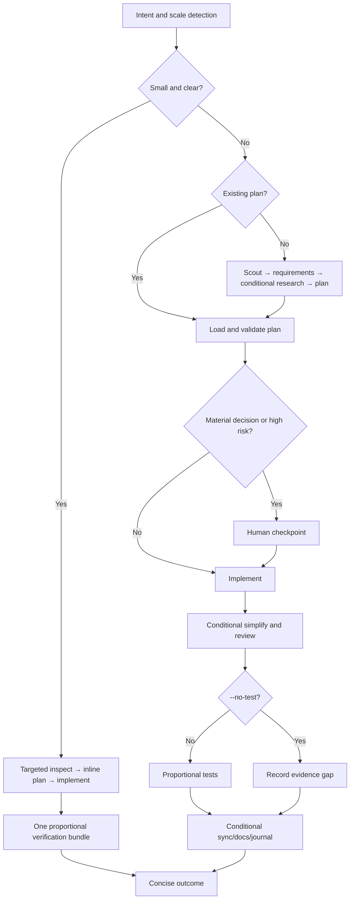

# Cook - Smart Feature Implementation

End-to-end implementation with automatic workflow detection.

**When NOT to use:** for a concrete bug, error, test failure, or CI failure use `/ck:fix` (root-cause diagnosis pipeline); for root-cause investigation only use `/ck:debug`. Cook is for features and plan execution.

**Principles:** YAGNI, KISS, DRY | Token efficiency | Concise reports

## Usage

```
/ck:cook <natural language task OR plan path>
```

With no flag, size the workflow to the task. Small, clear work stays inline;
complex or risky work uses the structured phases below.

**Optional flags to select the workflow mode:** 
- `--interactive`: Add human checkpoints where a decision is material
- `--fast`: Skip research, scout→plan→code
- `--parallel`: Multi-agent execution
- `--no-test`: Skip testing step
- `--auto`: Auto-approve low-risk steps; high-risk changes stop for human approval before finalize/commit/ship

**Composable flags** (combine with any mode):
- `--tdd`: Tests-first per phase — write tests for current behavior before
  refactoring, then verify they still pass after the implementation step

**Example:**
```
/ck:cook "Add user authentication to the app" --fast
/ck:cook path/to/plan.md --auto
/ck:cook "Refactor auth middleware" --tdd
```

<SCALE-GATE>
Classify the request before instantiating workflow artifacts:

- **Small and clear:** inspect only the relevant files, infer routine reversible
  details, state an inline intent/plan, implement, run one proportional check, and
  report the outcome concisely. Skip plan files, questionnaires, subagents, human
  checkpoints, project sync, docs, and journals unless they are directly useful
  or explicitly requested.
- **Standard:** use a short plan and targeted research/testing. Create a durable
  plan only when it improves coordination or resumability.
- **Large/high-risk:** use the full phased workflow and durable evidence. Pause
  for a decision only when alternatives materially change behavior, contracts,
  risk, cost, or external side effects.

This gate takes precedence over later phase descriptions. User instructions can
request a lighter or heavier workflow.
</SCALE-GATE>

<SCOUT-GATE>
Inspect enough code to locate the change, its local conventions, affected tests,
and any public contract at risk. For standard/large work, expand to relevant docs
and in-flight plans. Share findings only when they affect the approach or a user
decision; do not force a pre-question status report for routine changes. A supplied
`plan.md` or `phase-*.md` can satisfy this gate when it is current.
</SCOUT-GATE>

<REQUIREMENTS-GATE>
Before a durable plan, capture the items below from the request, code, or reasonable
reversible inference. Ask only for a missing answer that would materially change
the implementation:

1. **Expected output**: the concrete artifact(s) the user will see at the end (file paths, feature behavior, UI screen, API endpoint + payload, CLI command + flags).
2. **Acceptance criteria**: specific behaviors / inputs → outputs / edge cases that MUST work to call it "done".
3. **Scope boundary**: what is explicitly OUT of scope this round.
4. **Non-negotiable constraints**: stack, file locations, naming, backward compatibility, deadlines, performance.
5. **Touchpoints**: which existing files/modules (from scout) will be modified or extended; which contracts must stay stable.

Ground any question in scout findings and present concrete alternatives. Do not
turn already clear requirements into a five-question ceremony. Skip this inventory
for small work and when a supplied plan already answers it.
</REQUIREMENTS-GATE>

<VERIFICATION-GATE>
Implementation is done when fresh, proportional evidence supports the requested
behavior and the relevant regression surface:

1. New behavior matches every acceptance criterion above.
2. Targeted tests pass, plus broader tests when shared contracts or risk warrant them.
3. Relevant callers and touchpoints remain compatible.
4. Applicable lint/type/build checks pass at the narrowest meaningful scope.
5. Public contracts unchanged unless intentional and called out (function signatures, exported types, API responses, DB schemas, env vars, config keys).

If the user invoked `--no-test`, report the resulting evidence gap. Do not invent
certainty or require a reviewer subagent as a substitute for executable evidence.

If verification reveals a regression, fix it when the correction is clearly
in-scope and reversible. Ask the user when resolution requires a contract/scope
choice, new authority, or acceptance of the regression; present:
- What broke (file, test, workflow, user-facing behavior)
- Why this implementation caused it (1-line cause)
- 2-4 concrete options for the user to choose, e.g.:
  - "Revert this slice and re-plan with stricter scope"
  - "Keep the implementation and update <dependents> to match the new contract"
  - "Add a compatibility shim at <boundary> so old callers keep working"
  - "Accept the regression — old behavior was unintended/buggy"

Do not silently accept regressions.
</VERIFICATION-GATE>

## Smart Intent Detection

| Input Pattern | Detected Mode | Behavior |
|---------------|---------------|----------|
| Path to `plan.md` or `phase-*.md` | code | Execute existing plan |
| Contains "fast", "quick" | fast | Skip research, scout→plan→code |
| Contains "trust me", "auto" | auto | Auto-approve low-risk artifact-validated steps; stop on high-risk |
| Lists 3+ features OR "parallel" | parallel | Multi-agent execution |
| Contains "no test", "skip test" | no-test | Skip testing step |
| Default | proportional | Inline for small work; phased for standard/large work |

See `references/intent-detection.md` for detection logic.

## Process Flow (Authoritative)



**This diagram is the authoritative workflow.** Prose sections below provide detail for each node. If prose conflicts with this flow, follow the diagram.

## Workflow Overview

```
[Intent + Scale] → [Targeted Scout] → [Plan if useful] → [Implement] → [One Evidence Bundle] → [Conditional Finalize Artifacts]
```

**Default:** proceeds autonomously through routine, reversible steps and pauses on
material ambiguity or high-risk external effects.
**Interactive mode:** adds checkpoints at material decisions, not after every phase.
**Auto mode (`--auto`):** continues through low-risk artifact-validated steps;
high-risk commit/ship or contract choices still stop for approval.
**Claude Tasks:** Utilize `TaskCreate`, `TaskUpdate`, `TaskGet`, `TaskList` during implementation step. **Fallback:** These are CLI-only tools — unavailable in VSCode extension. If they error, use `TodoWrite` for progress tracking instead.

| Mode | Research | Testing | Review Gates | Phase Progression |
|------|----------|---------|--------------|-------------------|
| interactive | Conditional | ✓ | Material decisions | One at a time |
| auto | ✓ | ✓ | Auto only if artifacts pass and high-risk stop is false | All low-risk phases continuously |
| fast | ✗ | ✓ | Material decisions | One at a time |
| parallel | Optional | ✓ | Material decisions | Parallel groups |
| no-test | Conditional | ✗ | Material decisions | One at a time |
| code | ✗ | ✓ | Material decisions | Per plan |

## Step Output Format

```
✓ Step [N]: [Brief status] - [Key metrics]
```

## Human Decision Gates

Ask for approval when research exposes materially different product choices, a
plan changes public contracts, implementation would cause a high-risk external
effect, or verification exposes a regression that cannot be safely resolved
inside the authorized scope. Phase completion alone is not a reason to pause.

**Always enforced (all modes):**
- **Testing:** applicable selected checks must pass (unless no-test mode); report
  unrelated/pre-existing failures separately.
- **Code Review:** review inline by default. For broad, difficult, or high-risk
  changes, a `code-reviewer` may independently check:
  (a) every acceptance criterion met,
  (b) no regression to business logic in touchpoints/blast-radius,
  (c) no breaking changes to public contracts (signatures, schemas, APIs, env vars) unless called out,
  (d) follows existing patterns from scout,
  (e) no new lint/type/build errors anywhere.
  Pass scout evidence and acceptance criteria as context. Do not add a second
  verifier merely to verify the first reviewer.
- **Finalize:** sync an existing plan/task only when one was used; update docs when
  public behavior or operating instructions changed; journal only noteworthy
  decisions; offer commit/ship only when within the user's requested workflow.

## Required Subagents

| Phase | Subagent | Requirement |
|-------|----------|-------------|
| Research | `researcher` | Novel/version-sensitive independent research |
| Scout | `ck:scout` | Broad codebase discovery |
| Plan | `planner` | Complex multi-phase design |
| UI Work | `general-purpose` | Independent sizeable frontend stream |
| Testing | `tester`, `debugger` | Difficult or parallel verification |
| Review | `code-reviewer` | Broad/high-risk independent review |
| Finalize | project/docs/git specialists | Only when their artifact is needed |

**Delegation contract:** testing, review, and finalization are activities, not a
mandatory agent chain. Delegate only when the worker has an independent deliverable
and coordination will save time or add domain evidence. Otherwise do the work
inline. See `./.claude/rules/opus-5-calibration.md` §3.

## References

- `references/intent-detection.md` - Detection rules and routing logic
- `references/workflow-steps.md` - Detailed step definitions for all modes
- `references/review-cycle.md` - Interactive and auto review processes
- `references/subagent-patterns.md` - Subagent invocation patterns
- `../_shared/references/workflow-artifacts.md` - Review artifact schema and validator contract

## Workflow Position

**Typically follows:** `/ck:plan` (execute a plan), `/ck:brainstorm` (implement agreed solution)
**Typically precedes:** `/ck:code-review` (review after implementation), `/ck:test` (validate changes)
**Related:** `/ck:fix` (alternative for bug fixes), `/ck:plan` (create plan before cooking)
