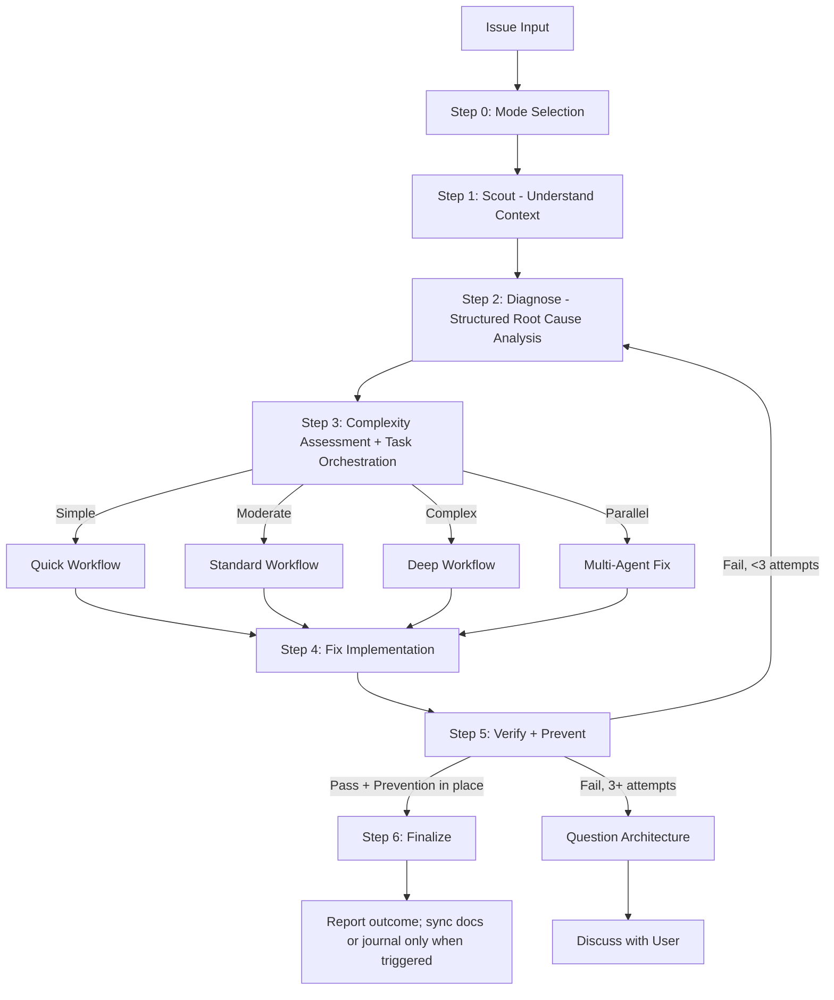

# Fixing

Unified skill for fixing issues of any complexity with intelligent routing.

## Arguments

- `--auto` - Activate autonomous mode (**default**); high-risk fixes stop for human approval before finalize/commit/ship
- `--review` - Activate human-in-the-loop review mode
- `--quick` - Activate quick mode
- `--parallel` - Activate parallel mode: route to parallel `general-purpose` agents per issue

<HARD-GATE>
Do NOT propose or implement fixes before completing Steps 1-2 (Scout + Diagnose).
The depth of both steps is proportional: a one-line lint failure can be located and
diagnosed in the same short pass; a production or cross-module failure needs a
durable evidence chain. Fix the cause rather than guessing at the symptom.
If 3+ fix attempts fail, STOP and question the architecture — discuss with user before attempting more.
`--quick` uses a fast scout→diagnose→fix cycle for trivial issues.
</HARD-GATE>

<SCOUT-GATE>
Inspect the codebase before forming a fix hypothesis. For standard/deep work,
collect:
1. Project type, language(s), framework(s) — from package.json/pyproject.toml/go.mod/etc.
2. The exact file(s) where the symptom surfaces + their direct callers/dependents
3. Related tests covering the affected area
4. Recent commits (`git log --oneline -20`) touching scouted files — possible introducer
5. Existing patterns/conventions for this kind of code (so the fix matches them)

For quick work, locate the failing line, local convention, and relevant check.
Share a context summary only when it changes the approach or informs a user choice.
</SCOUT-GATE>

<ROOT-CAUSE-GATE>
Before implementing, establish enough of the following to distinguish cause from
symptom. Record a full inventory for moderate/complex failures; do not block a
trivial, deterministic fix on irrelevant history:

1. **Exact symptom**: precise error message / failing assertion / observed behavior (copy verbatim, not paraphrased).
2. **Reproduction steps**: minimal sequence that triggers it (commands, inputs, environment).
3. **Expected vs actual**: what SHOULD happen vs what DOES happen.
4. **Root cause** (not symptom): the underlying defect — a specific line, missing check, race condition, contract violation, or design flaw. Cite file:line evidence.
5. **Why now**: what change/condition exposed it (recent commit, data shape, env, dep upgrade).
6. **Blast radius**: every code path that depends on the broken behavior or shares the same root cause.

If a material item remains unknown, gather more evidence or ask for information
that cannot be discovered locally. Mark inferences as inferences; never guess.

Ground questions in specific scout findings and ask only when different answers
would change the fix.
</ROOT-CAUSE-GATE>

<VERIFICATION-GATE>
The fix is done when a fresh, proportional evidence bundle shows:

1. Original symptom no longer reproduces (re-run exact pre-fix repro from Step 2).
2. Targeted regression checks pass, plus broader tests when shared contracts or
   the identified blast radius warrant them.
3. Relevant dependent behavior remains compatible.
4. Applicable lint/type/build checks pass at the narrowest meaningful scope.
5. Public API contracts (function signatures, exported types, response shapes, DB schemas, env vars) unchanged — OR change is intentional and called out.

If verification reveals a regression, repair it when clearly in scope and
reversible. Ask the user only when resolution requires a material contract/scope
choice, new authority, or acceptance of the regression. Present:
- What broke (file, test, workflow)
- Why the fix caused it (1-line cause)
- 2-4 concrete options to choose from, e.g.:
  - "Revert the fix and try a different root-cause angle"
  - "Keep the fix and update the dependent code at <files> to match the new contract"
  - "Narrow the fix scope to <subset> so the regression goes away"
  - "Accept the regression — it was buggy behavior the test was locking in"

Do not silently accept a regression.
</VERIFICATION-GATE>

## Process Flow (Authoritative)



**This diagram is the authoritative workflow.** If prose conflicts with this flow, follow the diagram.

## Workflow

### Step 0: Mode Selection

Infer the lightest safe mode from the evidence and request. Ask about mode only
when the choice introduces materially different human checkpoints or risk:

| Option | Recommend When | Behavior |
|--------|----------------|----------|
| **Autonomous** (default) | Simple/moderate issues | Continue through reversible in-scope work; pause only for material decisions |
| **Human-in-the-loop Review** | Critical/production code | Pause at material risk/contract decisions |
| **Quick** | Type errors, lint, trivial bugs | Targeted scout → diagnose → fix → proportional check |

See `references/mode-selection.md` for AskUserQuestion format.

### Step 1: Scout

**Purpose:** Understand the affected codebase BEFORE forming any hypotheses.

**Skill chain:**
1. Inspect directly, activate `ck:scout`, or launch focused `Explore` workers when
   broad independent discovery justifies delegation
2. Discover: affected files, dependencies, related tests, recent changes (`git log`)
3. Read `./docs` for project context if unfamiliar

**Quick mode:** Minimal scout — locate affected file(s) and their direct dependencies only.
**Standard/Deep mode:** Full scout — map module boundaries, test coverage, call chains.

**Output:** `✓ Step 1: Scouted - [N] files mapped, [M] dependencies, [K] tests found`

### Step 2: Diagnose

**Purpose:** Structured root cause analysis — evidence-based, not guessed.

**Skill chain:**
1. **Capture pre-fix state:** record the smallest reproducible failure. This is the
   baseline for Step 5.
2. Use direct inspection or `ck:debug` for systematic root-cause tracing.
3. For competing hypotheses, test the cheapest discriminating evidence first.
4. Delegate independent hypotheses only when they can run in parallel without
   duplicating context.
5. After two failed hypotheses, reconsider assumptions and broaden inspection.
6. Write a diagnosis report only when complexity or handoff value warrants it.

See `references/diagnosis-protocol.md` for full methodology.

**Output:** `✓ Step 2: Diagnosed - Root cause: [summary], Evidence: [brief], Scope: [N files]`

### Step 3: Complexity Assessment & Task Orchestration

Classify before routing. See `references/complexity-assessment.md`.

| Level | Indicators | Workflow |
|-------|------------|----------|
| **Simple** | Single file, clear error, type/lint | `references/workflow-quick.md` |
| **Moderate** | Multi-file, root cause unclear | `references/workflow-standard.md` |
| **Complex** | System-wide, architecture impact | `references/workflow-deep.md` |
| **Parallel** | 2+ independent issues OR `--parallel` flag | Parallel `general-purpose` agents |

**Task Orchestration (Moderate+ only):** Use native Claude Tasks when the work has
independently trackable phases, dependencies, or handoff value. Do not create a task
graph merely because the fix is multi-file. See `references/task-orchestration.md`.
- Skip for Quick workflow (< 3 steps, overhead exceeds benefit)
- Use `TaskCreate` with `addBlockedBy` for dependency chains
- Update via `TaskUpdate` as each phase completes
- For Parallel: create separate task trees per independent issue
- **Fallback:** Task tools (`TaskCreate`/`TaskUpdate`/`TaskGet`/`TaskList`) are CLI-only — unavailable in VSCode extension. If they error, use `TodoWrite` for progress tracking. Fix workflow remains fully functional without them.

### Step 4: Fix Implementation

- Implement fix per selected workflow, updating Tasks as phases complete.
- Follow diagnosis findings — fix the ROOT CAUSE, not symptoms.
- Minimal changes only. Follow existing patterns.

### Step 5: Verify + Prevent

**Purpose:** show the fix works and cover the relevant regression surface with one
coherent evidence bundle. See `VERIFICATION-GATE`.

**Skill chain:**
1. **Reproduce:** rerun the pre-fix command or equivalent executable check.
2. **Regression coverage:** add or update a focused test when it provides lasting
   value and can distinguish the defect.
3. **Affected checks:** run tests for modified modules and broaden only across
   shared contracts or a demonstrated blast radius.
4. **Review:** inspect the final diff inline; use one independent reviewer for
   broad, difficult, or high-risk changes.
5. **Artifacts:** write workflow artifacts only when the selected workflow or CI
   gate consumes them.
6. **Prevention:** add the narrowest guard that prevents this bug class when useful.
7. **Parallel checks:** parallelize typecheck/lint/build/test only when the suite is
   large enough to recover the coordination cost.

**If verification fails or a side effect is detected:** follow
`VERIFICATION-GATE`. Repair a clear, reversible, in-scope regression; ask only when
the resolution changes contract, scope, authority, or accepted behavior.

**If verification fails:** Loop back to Step 2 (re-diagnose). After 3 failures → question architecture, discuss with user.

See `references/prevention-gate.md` for prevention requirements.

**Output:** `✓ Step 5: Verified - [before/after comparison], [checks run], [prevention added when useful]`

### Step 6: Finalize (every fix, including quick mode)

1. Report the outcome, root cause, changes, fresh checks, and unresolved risks using
   `verified`, `inferred`, or `unknown` evidence states rather than a confidence score
2. Sync project/plan status only when this fix belongs to an existing tracked plan
3. Update docs when public behavior or operating instructions changed
4. `TaskUpdate` → mark ALL Claude Tasks `completed` (skip if Task tools unavailable)
5. Commit or push only when requested; use the git workflow directly or delegate only
   when that work is independently substantial
6. Journal only a noteworthy technical decision or lesson

---

## Skill/Subagent Activation Matrix

See `references/skill-activation-matrix.md` for complete matrix.

**Use when warranted:**
- `ck:scout` — broad discovery beyond a targeted local inspection
- `ck:debug` — non-trivial root-cause investigation
- `ck:sequential-thinking` — multiple stubborn competing hypotheses
- `ck:project-management` — sync an existing tracked plan

**Conditional:**
- `ck:brainstorm` — multiple valid approaches, architecture decision (Deep only)
- `ck:context-engineering` — fixing AI/LLM/agent code

**Subagents:** `debugger`, `researcher`, `planner`, `code-reviewer`, `tester`, `Bash`
**Parallel:** Multiple `Explore` agents for scouting, `Bash` agents for verification

## Output Format

Unified step markers:
```
✓ Step 0: [Mode] selected
✓ Step 1: Scouted - [N] files, [M] deps
✓ Step 2: Diagnosed - Root cause: [summary]
✓ Step 3: [Complexity] detected - [workflow] selected
✓ Step 4: Fixed - [N] files changed
✓ Step 5: Verified + Prevented - [tests added], [guards added]
✓ Step 6: Complete - [action taken]
```

## References

Load as needed:
- `references/mode-selection.md` - AskUserQuestion format for mode
- `references/diagnosis-protocol.md` - Structured diagnosis methodology (NEW)
- `references/prevention-gate.md` - Prevention requirements after fix (NEW)
- `references/complexity-assessment.md` - Classification criteria
- `references/task-orchestration.md` - Native Claude Task patterns for moderate+ workflows
- `references/workflow-quick.md` - Quick: scout → diagnose → fix → verify+prevent → review
- `references/workflow-standard.md` - Standard: full pipeline with Tasks
- `references/workflow-deep.md` - Deep: research + brainstorm + plan with Tasks
- `../_shared/references/workflow-artifacts.md` - Review artifact schema and validator contract
- `references/review-cycle.md` - Review logic (autonomous vs HITL)
- `references/skill-activation-matrix.md` - When to activate each skill
- `references/parallel-exploration.md` - Parallel Explore/Bash/Task coordination patterns

**Specialized Workflows:**
- `references/workflow-ci.md` - GitHub Actions/CI failures
- `references/workflow-logs.md` - Application log analysis
- `references/workflow-test.md` - Test suite failures
- `references/workflow-types.md` - TypeScript type errors
- `references/workflow-ui.md` - Visual/UI issues (requires design skills)

## Workflow Position

**Typically follows:** `/ck:debug` (after root cause analysis), `/ck:scout` (after locating affected code)
**Typically precedes:** `/ck:code-review` (review the fix), `/ck:test` (validate the fix)
**Related:** `/ck:cook` (alternative for feature work), `/ck:debug` (diagnose before fixing)
